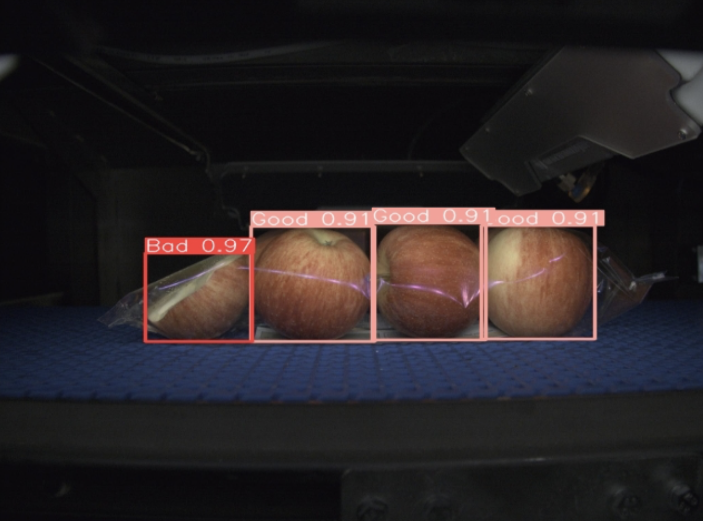

Hi there! 
I hold a Master's degree in Robotics and Autonomous Systems from the University of Bath and a Bachelor's degree in Electrical and Electronics Engineering from the University of Brighton. Currently, work at Diamond Light Source (Synchrotron) as a senior PLC engineer.
Beyond my professional roles, I do running and swimming!

[Email](mailto:g.nithianandam@gmail.com) / [LinkedIn](https://www.linkedin.com/in/gokulan-nithianandam) / [GitHub](https://github.com/GNithianandam)

## Education						       		
- M.Sc., Robotics and Autonomous Systems	       |University of Bath (_September 2022_)	 			        		
- BEng., Electrical and Electronics Engineering  |University of Brighton (_June 2018_)

## Work Experience
### P2i Limited – Oxford, UK. (_June 2023 - Present_)

P2i is a technology company specializing in liquid-repellent nano-coating solutions that make electronic devices and textiles water-resistant. Their technology creates an invisible barrier on surfaces, protecting them from water damage and enhancing durability.

- Developed an Electrical Resistivity test software using .NET framework. Used SCPI commands to communicate with Kiethley Power Supply and Multimeter. Aquired 40 channel data and stored the analysed data in maria DB database.
- Developed a Time-Based One-Time Password (TOTP) authenticator application utilizing the .NET framework. Integrated the software to the Beijer HMI for user authentication.
- Programmed Plasma-enhanced chemical vapor deposition (PEVD) using Siemens PLC and used profibus and profinet to communicate with field devices. 
- **_Technologies used:_** Siemen's TIA Portal, Profibus, Profinet, .NET, MariaDB, Beijer's IX Developer
  
### Brillopak Limited – East Peckham, UK. (_June 2018 - May 2023_)

Brillopak is an automation and robotics company that designs and manufactures packaging solutions for the food industry. 

- Developed high-speed pick and place robotic systems from concept to completion using EV+ and C# programming languages.
- Designed and executed control systems for multiple industries, including manufacturing, agriculture, and food production.
- Involved in SAT and FAT phases of the project.
- **_Technologies used:_** Omron's Sysmac Studio, Ethercat, Ethernet/IP, Adept Robotics, .NET
  
## Projects
### Classification of Motor Imagery tasks 🧠
The project's major goal is finding the optimal combination of approaches to decode motor
imagery task with less data and achieving a higher classification accuracy by performing a
comparison study between combination of Deep Learning models and data augmentation
methods.[Project Link](https://github.com/GNithianandam/EEG-Motor-Imagery-classification)  
**_Technologies used:_** Tensorflow, Python, Deep Learning, Neuroscience

### Sofware development for bolt making machine 🔩

Conducted remote programming and testing of bolt-making machines for an Australian client. Configured Programmable Logic Controllers (PLC) and Human Machine Interfaces (HMI) based on Omron technology. Established serial communication protocols with both facing and drilling machines.  
**_Technologies used:_** Omron sysmac studio, Ethercat, Serial Communication, Servo drives

### AquaMetrics: Managing Swim Sessions and Performance Data 🏊🏼
Developed and implemented swim training application to elevate the swimming experience through the seamless integration of MySQL and the .NET framework. This application serves as a comprehensive tool for swimmers, coaches, and fitness enthusiasts to meticulously record, analyze, and enhance their swim sessions.  
**_Technologies used:_** MySQL, .Net 

### Enhancing Wildfire Detection from UAV Imagery: A Transfer Learning and Data Augmentation Approach
Implemented pre-trained deep learning model MobileNetV2 to realize transfer learning technique and data augmentation methodology to detect wildfires using UAV. The MobileNetV2 is trained and validated with the help of the MATLAB software's Deep Network Designer.  
**_Technologies used:_** MATLAB, MobileNetV2  

### Apple pack QC

Used YoloV8 object detection algorithm to detect the defective apple and counting number of apples in a pack. The bad packs are detected and rejected using servo driven arm. The application is implemened using a web application developed using streamlit. Furthermore, the results are stored in the MYSQL database as part of the MES. In addition, the application provides user authentication and managements where the users credentials are encrypted using SHA512 and stored in the database.  
**_Technologies used:_** MYSQL, YOLOV8, Streamlit  

